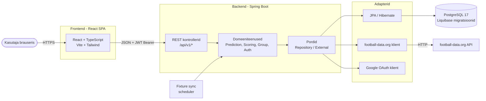
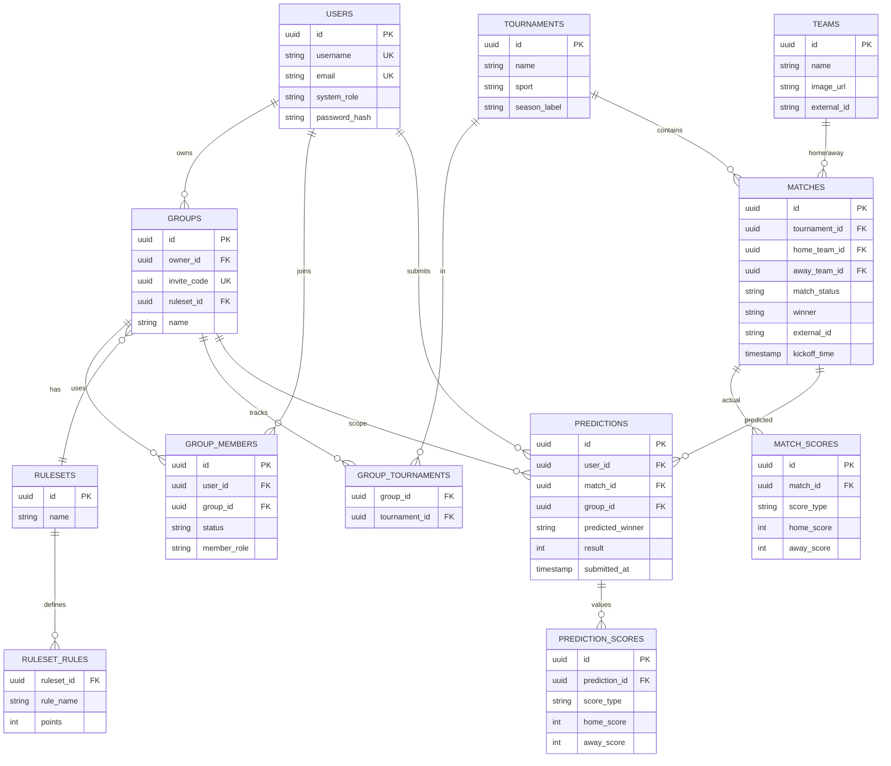
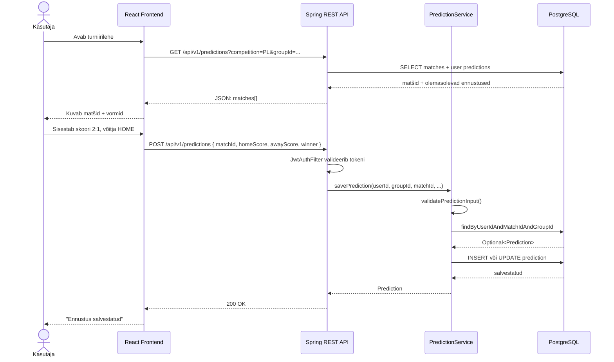
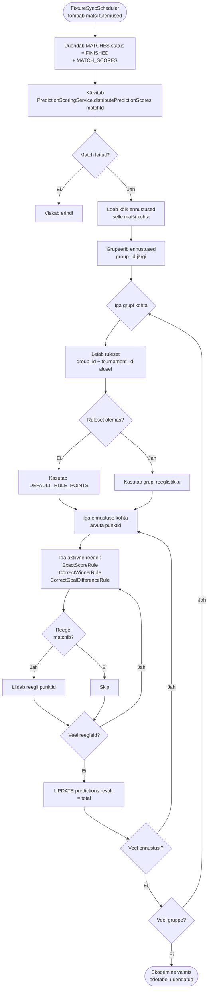

# Predict-o-rama — Tehniline ülevaade (3 min)

> Esitluse mustand: ~3 minutit. Iga peatükk = ~30 s rääkimist.
> Diagrammid on Mermaid-formaadis — renderduvad GitHubis ja enamikus Markdown-tööriistades.

---

## 1. Mis on Predict-o-rama? (~20 s)

Predict-o-rama on jalgpalli ennustusmäng peredele ja sõpruskondadele. Kasutajad loovad gruppe, ennustavad päris turniiride matšide tulemusi (Premier League, Champions League, MM), ja saavad punkte vastavalt grupi reeglistikule. Matšiandmed sünkroonitakse automaatselt football-data.org API-st.

**Põhifunktsioonid:**
- Kasutaja autentimine (e-mail/parool + Google OAuth)
- Gruppide loomine ja kutselinkidega liitumine
- Matšide ennustamine (skoor + võitja)
- Automaatne tulemuste skoorimine konfigureeritava reeglistiku alusel
- Edetabel grupi sees turniiri kohta

---

## 2. Arhitektuur (~40 s)

Klassikaline kolmekihiline arhitektuur: React SPA → Spring Boot REST API → PostgreSQL. 

Backend:
- heksagonaalne arhitektuur - **portide ja adapterite** mustrit — domeeniloogika ei sõltu raamistikust, välistest integratsioonidest ega andmebaasist
- domain kiht
  - defineerib ära domeeniobjektid, serviced ja pordid
- adapter kiht
  - defineeritakse controllerid, dto, db entity-d, repository adapterid, external integrations adapterid
  - integratsioonid:
    - football.org API - automatiseeritud andmete import, mis tõmbab perioodiliselt (scheduled jobina) uusi matše ja tulemusi)
    - Google - Google auth kasutades Google Client Id-d -> authenitificaton tulemusena väljastakse JWT
  - REST API:
    - versioneeritud api endpointid
    - Spring security ja JWT securitycontext
  - Persistance
    - JPA repository -
  - 

Andmebaas:
- JPA 
- Andmebaasi migratsioonid kasutades Liquibase'i 

Frontend: 
- React
  **Olulised punktid:**
- Frontend ja backend on Docker-kontainerid, ees Caddy/nginx reverse proxy
- JWT Bearer token autentimisel — stateless, ei vaja sessioonisalvestust
- Domain-kihis on liides (`port`), implementatsioon (`adapter`) on välimises kihis → kergesti testitav, raamistikust sõltumatu
- Ajastatud `FixtureSyncScheduler` tõmbab perioodiliselt uusi matše ja tulemusi

---

## 3. Tehnoloogia stack (~25 s)

| Kiht | Tehnoloogiad |
|------|--------------|
| **Frontend** | React 19, TypeScript, Vite, Tailwind CSS, React Router 7, i18next, Vitest |
| **Backend** | Spring Boot 4, Java 21, Spring Web MVC, Spring Data JPA, Spring Security, Lombok |
| **Auth** | JWT (jjwt), Google OAuth (google-api-client), BCrypt |
| **Andmebaas** | PostgreSQL 17, Liquibase (migratsioonid), Hibernate (ainult validate) |
| **Välised teenused** | football-data.org (matšid), Google Identity (sisselogimine) |
| **Dokumentatsioon** | SpringDoc OpenAPI / Swagger UI |
| **Infra / DevOps** | Docker Compose, GitHub Actions (CI/CD), GHCR, deploy üle SSH VPS-i |

---

## 4. Andmebaasiskeem (~45 s)

Põhientiteedid: **kasutaja → grupp → ennustus → matš → turniir**. Reeglistik (`ruleset`) seob grupi ja turniiri konkreetsete skooripunktidega. Iga match-skoor ja ennustuse-skoor on eraldi tabelites, et toetada lisaaegu ja penaltisid.

**Tähelepanekud:**
- `predictions` on unikaalne `(user_id, match_id, group_id)` peale — sama kasutaja võib sama matši kohta erinevates gruppides erineva ennustuse teha
- Skoorid on normaliseeritud eraldi tabelitesse (`match_scores`, `prediction_scores`) → toetab `NORMAL_TIME`, `FULL_TIME`, `EXTRA_TIME`, `PENALTIES` lisamist ilma skeemimuudatuseta
- Liquibase muudatuste fail on rangelt versioneeritud (`001-init.yaml` … `019-configurable-rulesets.yaml`)

---

## 5. Voodiagramm — ennustuse esitamine (~30 s)

Tüüpiline kasutusvoog: kasutaja vaatab oma grupi turniiri, esitab ennustuse, backend valideerib ja salvestab.

---

## 6. Tegevusdiagramm — automaatne skoorimine (~30 s)

Kui matš lõppeb, käivitatakse skoorimisahel: tegelik tulemus võrreldakse iga ennustusega, ja vastavalt grupi reeglistikule arvutatakse punktid.

**Disainivõit:** uue skoorimisreegli lisamine = uus klass, mis implementeerib `ScoringRule`-liidese. Spring DI korjab selle automaatselt üles, seda saab lisada igasse reeglistikku ilma teisi reegleid muutmata. **Open/Closed põhimõte praktikas.**

---

## 7. Kokkuvõte (~10 s)

- **Selge kihtide eraldatus** (hexagonal): domeeniloogikat saab katsetada ilma andmebaasita
- **Konfigureeritav reeglistik** grupi tasemel — sama matš annab erinevatele gruppidele erinevad punktid
- **Liquibase + ddl-auto=validate** garanteerib, et kood ja andmebaas on alati sünkroonis
- **CI/CD** GitHub Actions kaudu pushib Docker-image'id GHCR-i ja deploib VPS-i automaatselt push-il `dev` haru peale
