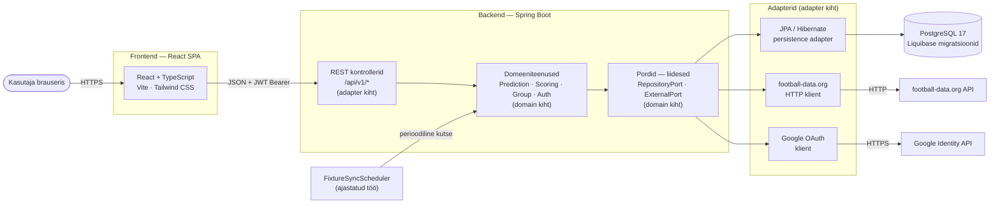
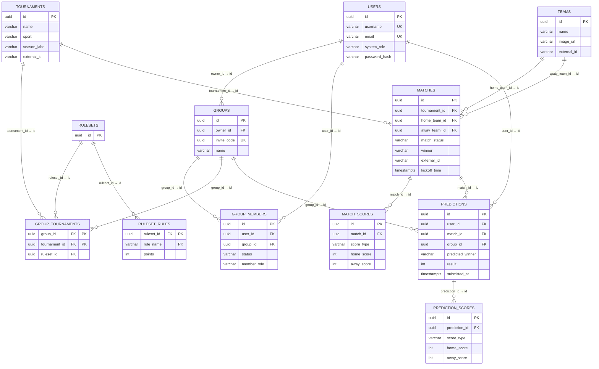
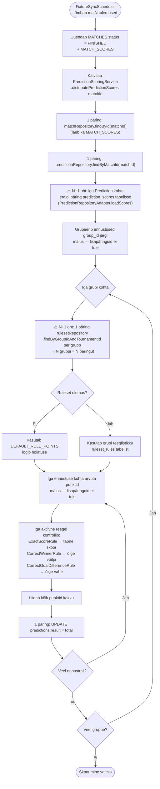

# Predict-o-rama — Tehniline ülevaade (3 min)

> Esitluse mustand: ~3 minutit. Iga peatükk = ~30 s rääkimist.
> Diagrammid on Mermaid-formaadis — renderduvad GitHubis ja enamikus Markdown-tööriistades.

---

## 1. Mis on Predict-o-rama? (~20 s)

Predict-o-rama on jalgpalli ennustusmäng peredele ja sõpruskondadele. Kasutajad loovad gruppe, ennustavad päris turniiride matšide tulemusi (Premier League, Champions League, MM) ja saavad punkte vastavalt grupi reeglistikule. Matšiandmed sünkroonitakse automaatselt football-data.org API-st.

**Põhifunktsioonid:**
- Kasutaja autentimine — e-mail/parool ja Google OAuth
- Gruppide loomine ja kutselinkide kaudu liitumine
- Matšide ennustamine (skoor + võitja) enne mängu algust
- Automaatne tulemuste skoorimine matši lõppedes, konfigureeritava reeglistiku alusel
- Edetabel grupi ja turniiri lõikes
- Automaatne matšide, meeskondade ja turniiride importimine football-data.org API-st

---

## 2. Tehnoloogia stack (~25 s)

| Kiht | Tehnoloogiad |
|------|--------------|
| **Frontend** | React 19, TypeScript, Vite, Tailwind CSS 4, React Router 7, i18next, Vitest |
| **Backend** | Spring Boot 4, Java 21, Spring Web MVC, Spring Data JPA, Spring Security, Lombok |
| **Autentimine** | JWT (jjwt), Google OAuth (google-api-client), BCrypt |
| **Andmebaas** | PostgreSQL 17, Liquibase (migratsioonid), Hibernate (`ddl-auto=validate`) |
| **Välised teenused** | football-data.org (matšiandmed), Google Identity (sisselogimine) |
| **API dokumentatsioon** | SpringDoc OpenAPI / Swagger UI |
| **Infra / DevOps** | Docker Compose, GitHub Actions CI/CD, GHCR, VPS deploy üle SSH |

Kõik kolm teenust (frontend, backend, PostgreSQL) on Docker-kontaineritena VPS-is. Caddy töötab reverse proxy-na — suunab päringu porti 80/443 vastavalt kas frontendi või backendi konteinerisse.

GitHub Secrets hoiavad tundlikke andmeid (JWT secret, DB parool, API võtmed). CI/CD pipeline kirjutab need VPS-i `.env` faili iga deploy ajal.

---

## 3. Arhitektuur (~40 s)

Backend järgib **heksagonaalset (portide ja adapterite) arhitektuuri** — domeeniloogika ei sõltu raamistikust, andmebaasist ega välistest integratsioonidest.



**Kihtide rollid:**

| Kiht | Sisu |
|------|------|
| **REST adapter** | Kontrollerid, DTO-d, päringu/vastuse mapperid, `JwtAuthFilter`, `GlobalExceptionHandler` |
| **Domain** | Äriloogika: teenused, domeeniobjektid, pordi liidesed. Ei sõltu Spring raamistikust ega JPA-st. |
| **Persistence adapter** | JPA entity-d, Spring Data repository-d, mapperid domeeniobjektideks |
| **External adapter** | football-data.org REST klient, Google OAuth token verifier |
| **Scheduler** | `FixtureSyncScheduler` kutsub domeeniteenust perioodiliselt — uuendab matšide staatused ja tulemused |

**Autentimine:** Spring Security + JWT Bearer token. Iga kaitstud päring läbib `JwtAuthFilter` → kasutaja ID lisatakse `SecurityContext`-i → kontrollerid loevad selle `AuthUtils.currentUserId()` kaudu.

**Swagger UI** on vaikimisi sisse lülitatud: `https://predictorama.online/swagger-ui/index.html`

---

## 4. Andmebaasiskeem (~45 s)

Põhiseos: **kasutaja → grupp → ennustus → matš → turniir**. Grupi ja turniiri kombinatsioonile (`group_tournaments`) on seotud reeglistik (`ruleset`) — seega sama grupp võib erinevaid turniirisid hinnata erinevate reeglitega.



**Olulised disainiotsused:**
- `predictions` on unikaalne `(user_id, match_id, group_id)` — sama kasutaja saab samas grupis iga matši kohta täpselt ühe ennustuse, kuid eri gruppides võib olla erinev ennustus
- Skoorid on normaliseeritud eraldi tabelitesse (`match_scores`, `prediction_scores`) — võimaldab lisada `EXTRA_TIME`, `PENALTIES` ilma skeemi muutmata
- **Reeglistik on seotud `group_tournaments` tasemel**, mitte grupi tasemel — grupp võib ühes turniiris kasutada üht reeglistikku ja teises teist
- `ruleset_rules` tabel on lihtne võtme-väärtuse kaart: reegli nimi (`EXACT_SCORE`, `CORRECT_WINNER`, `CORRECT_GOAL_DIFFERENCE`) → punktid. Uue reegli lisamine ei nõua skeemi muutust.

---

## 5. Voodiagramm — ennustuse esitamine (~30 s)

Tüüpiline kasutusvoog läbib kõik arhitektuuri kihid: REST → Domain teenus → Port → Adapter → DB.

```mermaid
sequenceDiagram
    actor U as Kasutaja
    participant FE as React Frontend
    participant CTRL as PredictionController
    participant QSVC as TournamentPredictionQueryService
    participant SVC as PredictionService
    participant PORT as RepositoryPort
    participant ADPT as JPA Adapter
    participant DB as PostgreSQL

    U->>FE: Avab turniirilehe
    FE->>CTRL: GET /api/v1/predictions?competition=PL&groupId=...
    note over CTRL: JwtAuthFilter valideerib<br/>JWT tokeni
    CTRL->>QSVC: getTournamentPredictions(competition, userId, groupId)
    QSVC->>PORT: MatchRepositoryPort.findByTournamentIdAndKickoffTimeBetween(...)
    PORT->>ADPT: JPA päring (JOIN FETCH meeskonnad + skoorid)
    ADPT->>DB: SELECT matches + teams + scores
    DB-->>ADPT: tulemused
    ADPT-->>PORT: List&lt;Match&gt;
    PORT-->>QSVC: matšid
    QSVC->>SVC: getPredictionsByUserAndGroup(userId, groupId)
    SVC->>PORT: PredictionRepositoryPort.findByUserIdAndGroupId(...)
    PORT->>ADPT: JPA päring
    ADPT->>DB: SELECT predictions + prediction_scores
    DB-->>ADPT: tulemused
    ADPT-->>PORT: List&lt;Prediction&gt;
    PORT-->>SVC: ennustused
    SVC-->>QSVC: Map&lt;matchId, Prediction&gt;
    QSVC-->>CTRL: TournamentPredictionsView
    CTRL-->>FE: JSON: { matches[] }
    FE-->>U: Kuvab matšid + ennustusvormid

    U->>FE: Sisestab skoori 2:1, võitja HOME, klõpsab Salvesta
    FE->>CTRL: POST /api/v1/predictions { matchId, groupId, homeScore, awayScore, winner }
    note over CTRL: JwtAuthFilter valideerib JWT
    CTRL->>SVC: savePrediction(userId, groupId, matchId, 2, 1, HOME)
    SVC->>SVC: validatePredictionInput()
    SVC->>PORT: findByUserIdAndMatchIdAndGroupId(...)
    PORT->>ADPT: JPA päring
    ADPT->>DB: SELECT prediction WHERE user+match+group
    DB-->>ADPT: Optional&lt;Prediction&gt;
    ADPT-->>PORT: Optional&lt;Prediction&gt;
    PORT-->>SVC: Optional.empty() (uus) või olemasolev
    SVC->>PORT: PredictionRepositoryPort.save(prediction)
    PORT->>ADPT: JPA upsert
    ADPT->>DB: INSERT / UPDATE predictions + prediction_scores
    DB-->>ADPT: salvestatud
    ADPT-->>SVC: Prediction
    SVC-->>CTRL: Prediction
    CTRL-->>FE: 200 OK { predictionId, ... }
    FE-->>U: "Ennustus salvestatud"
```

---

## 6. Tegevusdiagramm — automaatne skoorimine ja N+1 analüüs (~35 s)

Kui matš lõppeb, sünkroniseerib `FixtureSyncScheduler` tulemuse ning käivitab skoorimisahela.



### N+1 probleemide analüüs

Diagramm tõstatab õigustatud küsimuse — ja koodis on mitu N+1 probleemi kinnitust leidnud:

| Koht | Probleem | Mõju |
|------|----------|------|
| `PredictionRepositoryAdapter.loadScores()` | Iga `Prediction` laadimise järel eraldi päring `prediction_scores` tabelisse. Mõjutab **kõiki** meetodeid, mis kutsuvad `toDomainWithScores()` | M ennustust → M+1 päringut |
| `PredictionScoringService.distributePredictionScores()` | `rulesetRepository.findByGroupIdAndTournamentId()` kutsutakse grupeerimistsüklis iga grupi kohta eraldi | N gruppi → N päringut |
| `GroupService.getGroupTournaments()` | Tõmbab esmalt turniiride ID-d, seejärel `tournamentRepository.findById()` igaühe kohta eraldi | N turniiri → N+1 päringut |
| `GroupService.getUserGroups()` | Tõmbab liikmelisused, seejärel `groupRepository.findById()` iga grupi kohta eraldi | N gruppi → N+1 päringut |
| `UserUpcomingMatchQueryService.getUpcomingMatches()` | Sama muster: liikmelisused → per-grupp `findById()` | N gruppi → N+1 päringut |

**Mis on hästi lahendatud:** `MatchRepositoryAdapter.toMatches()` laadib meeskonnad (`findAllById`) ja skoorid (`findByMatchIdIn`) ühe batch-päringuga — siin N+1 ei esine.

**Lahendused:** batch-laadimiseks sobib `findAllById(ids)` / `findByIdIn(ids)` nende kohtade jaoks, kus ID-d on juba käes. `PredictionRepositoryAdapter.loadScores()` puhul lahendab selle `findByPredictionIdIn(ids)` + mälus grupeerimine — täpselt sama muster, mida `MatchRepositoryAdapter` juba kasutab.

**Disainivõit (skoorimisreeglid):** uue reegli lisamine = uus klass, mis implementeerib `ScoringRule`-liidese. Spring DI korjab selle automaatselt üles — **Open/Closed põhimõte praktikas**.

---

## 7. Kokkuvõte (~10 s)

- **Hexagonal arhitektuur** — domeeniloogika on raamistikust isoleeritud, kõiki teenuseid saab testida ilma andmebaasita
- **Konfigureeritav reeglistik per (grupp × turniir)** — sama grupp, erinevad reeglid eri turniiridele
- **Liquibase + `ddl-auto=validate`** — 19 versioneeritud migratsiooni, Hibernate valideerib skeemi käivitamisel
- **CI/CD** — push `dev` harusse käivitab automaatse build → GHCR push → VPS deploy üle SSH
