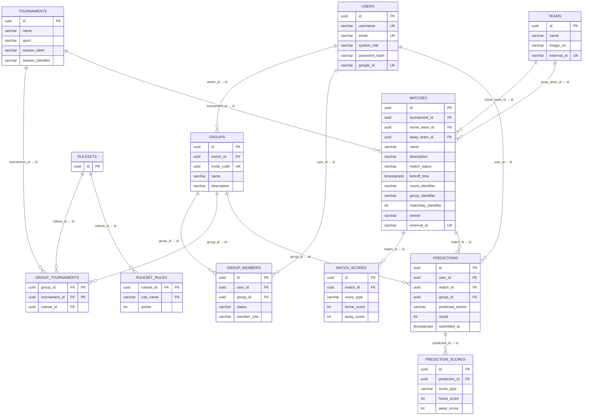

# Predict-o-rama — Tehniline ülevaade

**Põhifunktsioonid:**
- Kasutaja autentimine — e-mail/parool ja Google OAuth
- Gruppide loomine ja kutselinkide kaudu liitumine
- Matšide ennustamine (skoor + võitja) enne mängu algust
- Automaatne tulemuste skoorimine matši lõppedes, konfigureeritava reeglistiku alusel
- Edetabel grupi ja turniiri lõikes
- Automaatne matšide, meeskondade ja turniiride importimine football-data.org API-st

---

## 2. Tehnoloogia stack

| Kiht | Tehnoloogiad                                                                     |
|------|----------------------------------------------------------------------------------|
| **Frontend** | React 19, TypeScript, Vite, Tailwind CSS 4, React Router 7, i18next, Vitest      |
| **Backend** | Spring Boot 4, Java 21, Spring Web MVC, Spring Data JPA, Spring Security, Lombok |
| **Autentimine** | Google OAuth (google-api-client), JWT (jjwt)                         |
| **Andmebaas** | PostgreSQL 17, Liquibase (migratsioonid), Hibernate                              |
| **Välised teenused** | football-data.org (matšiandmed), Google Identity (sisselogimine)                 |
| **API dokumentatsioon** | SpringDoc OpenAPI / Swagger UI                                                   |
| **Infra / DevOps** | VM, Docker Compose, GitHub Actions CI/CD, GHCR, Github Secrets                   |

---

## 3. Arhitektuur


## 4. Backend

Backend järgib **heksagonaalset (portide ja adapterite) arhitektuuri** — domeeniloogika ei sõltu raamistikust, andmebaasist ega välistest integratsioonidest.

**Kihtide rollid:**

| Kiht | Sisu |
|------|------|
| **Domain** | Äriloogika: teenused, domeeniobjektid, pordi liidesed. Ei sõltu Spring raamistikust ega JPA-st. |
| **REST adapter** | Kontrollerid, DTO-d, päringu/vastuse mapperid, `JwtAuthFilter`, `GlobalExceptionHandler` |
| **Persistence adapter** | JPA entity-d, Spring Data repository-d, mapperid domeeniobjektideks |
| **External adapter** | football-data.org REST klient, Google OAuth token verifier |
| **Scheduler** | `FixtureSyncScheduler` kutsub domeeniteenust perioodiliselt — uuendab matšide staatused ja tulemused |

**Autentimine:** Spring Security + JWT Bearer token. Iga kaitstud päring läbib `JwtAuthFilter` → kasutaja ID lisatakse `SecurityContext`-i → kontrollerid loevad selle `AuthUtils.currentUserId()` kaudu.
**Swagger UI** on vaikimisi sisse lülitatud: `https://predictorama.online/swagger-ui/index.html`


```
com.predictorama.backend/
├── Application.java
├── config/
├── domain/                           # Zero framework dependencies
│   ├── entity/                       # Pure domain objects (no JPA / Spring)
│   ├── port/
│   │   ├── persistence/              # Repository port interfaces
│   │   └── external/                 # External service port interfaces
│   ├── service/                      # All business logic lives here
│   └── exception/
│
└── adapter/
    ├── rest/                         # HTTP layer
    │   ├── controller/               # PredictionController, GroupController, ...
    │   ├── dto/                      # Request / Response DTOs
    │   ├── mapper/                   # Domain → DTO mappers
    │   └── GlobalExceptionHandler.java
    ├── persistence/                  # JPA layer
    │   ├── adapter/                  # XxRepositoryAdapter (implements ports)
    │   ├── entity/                   # JPA entities (extend BaseEntity)
    │   ├── mapper/                   # Entity ↔ Domain mappers
    │   └── repository/               # Spring Data JPA interfaces
    ├── external/
    │   ├── footballdata/             # football-data.org HTTP client + response DTOs
    │   └── google/                   # Google OAuth token validator
    └── scheduler/                    # FixtureSyncScheduler — periodic fixture sync
```


---

## 5. Frontend
Frontend on ehitatud leheküljekesksele modulaarsele arhitektuurile — iga lehekülg elab oma kaustas src/pages/<PageName>/, millel on oma components/ ja hooks/ alamkaustad lokaalse koodi jaoks.

Kihid on rangelt lahutatud: 
- komponendid vastutavad ainult UI renderdamise eest, 
- hookid haldavad seisundit, efekte ja andmevoogu, ning 
- teenused (src/services/) tegelevad kõigi HTTP/API päringutega.
    
Mitmekeelsus on läbiv arhitektuuriline nõue: iga kasutajale nähtav tekst läbib i18next t()-funktsiooni ja võtmed peavad olema kõigis kolmes lokaalifailis (en, et, ru)
samaaegselt.


```
frontend/src/
├── main.tsx                          # Entry point
├── App.tsx                           # Root component + providers

├── app/
│   ├── routePaths.ts                 # Centralised route path constants
│   └── router/AppRouter.tsx          # Route definitions
├── components/                       # Shared across multiple pages
├── context/
├── services/                         # All HTTP — hooks call these, components never do
│
├── i18n/locales/                     # en.json · et.json · ru.json (must stay in sync)
│
└── pages/                            # One folder per page — the core structural unit
    ├── HomePage/
    │   ├── HomePage.tsx              # Thin composition root
    │   ├── components/               # UI pieces used only by this page
    │   └── hooks/                    # useUpcomingMatches, useUpcomingMatchFilters
    ├── GroupPage/
    │   ├── GroupsPage.tsx
    │   ├── components/               # CreateGroupForm, MyGroupsList, ...
    │   └── hooks/                    # useGroups, useCreateGroupForm, ...
    ├── ...
    └── ...
```

---

## 6. Andmebaasiskeem




**Olulised disainiotsused:**
- `predictions` on unikaalne `(user_id, match_id, group_id)` — sama kasutaja saab samas grupis iga matši kohta täpselt ühe ennustuse, kuid eri gruppides võib olla erinev ennustus
- Skoorid on normaliseeritud eraldi tabelitesse (`match_scores`, `prediction_scores`) — võimaldab lisada `EXTRA_TIME`, `PENALTIES` ilma skeemi muutmata
- **Reeglistik on seotud `group_tournaments` tasemel**, mitte grupi tasemel — grupp võib ühes turniiris kasutada üht reeglistikku ja teises teist
- `ruleset_rules` tabel on lihtne võtme-väärtuse kaart: reegli nimi (`EXACT_SCORE`, `CORRECT_WINNER`, `CORRECT_GOAL_DIFFERENCE`) → punktid. Uue reegli lisamine ei nõua skeemi muutust.
---
